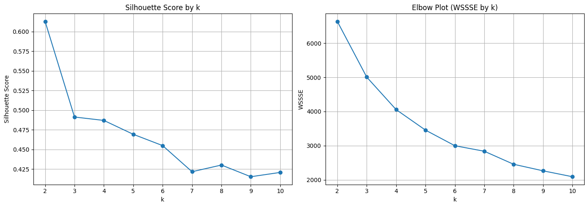
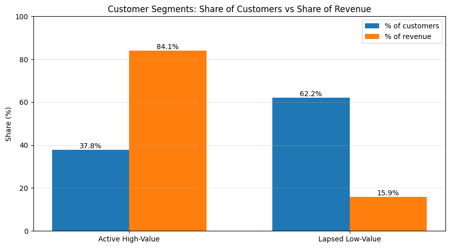
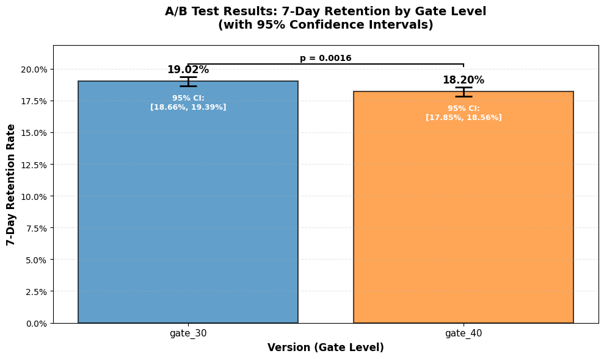
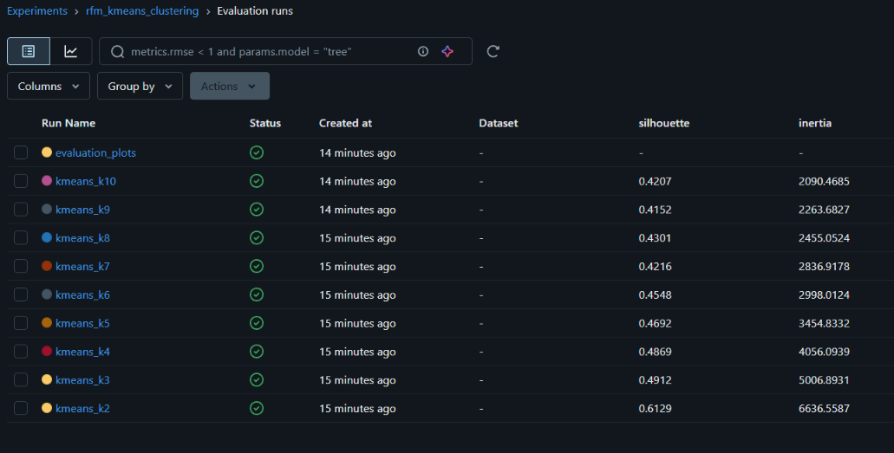

# Customer Analytics on Databricks: Segmentation & A/B Testing

An end-to-end customer analytics project built on **Databricks Free Edition**:
segmenting retail customers with RFM + KMeans in **PySpark**, analysing a 90k-player
A/B test with a pre-registered **power analysis**, and tracking every model run in **MLflow**.

**Tech stack:** Databricks · PySpark · Spark MLlib · Delta Lake · MLflow · statsmodels · SciPy · Matplotlib

---

## Key results

| Analysis | Result |
|---|---|
| Customer segmentation | 4,314 customers split into 2 segments; the **Active High-Value** segment is 37.8% of customers but drives **84.1% of revenue** |
| A/B test (Cookie Cats) | Moving the gate from level 30 → 40 **lowered 7-day retention by 0.82 pp** (19.02% → 18.20%, p = 0.0016, 95% CI [0.31, 1.33] pp). Recommendation: **keep gate_30** |
| Experiment tracking | 10 MLflow runs logged (KMeans k = 2–10 + evaluation plots) with params, metrics and artifacts |

---

## Part 1: Customer segmentation (RFM + KMeans)

**Notebook:** [`01_customer_segmentation.ipynb`](01_customer_segmentation.ipynb)
**Data:** [Online Retail II (UCI)](https://archive.ics.uci.edu/dataset/502/online+retail+ii), sheet *Year 2009–2010*: transactions from a UK online retailer, Dec 2009 – Dec 2010.

### Approach
1. **Cleaning (PySpark):** removed rows with no Customer ID, cancelled invoices (`Invoice` starting with "C") and negative quantities
   → 525,461 → **407,695 rows** (117,766 dropped). The clean data is saved once as a **Delta table** so later steps don't re-read the raw Excel file.
2. **Feature engineering:** aggregated to one row per customer with
   **Recency** (days since last purchase), **Frequency** (distinct invoices) and **Monetary** (total spend) → **4,314 customers**.
3. **Preprocessing:** `log1p` transform to tame heavy right skew, then `StandardScaler` (zero mean, unit variance).
4. **Model selection:** Spark MLlib KMeans for k = 2…10, evaluated with silhouette score and the elbow (WSSSE) curve, with every run logged to MLflow.



k = 2 gave the highest silhouette (0.613); k = 3–4 formed a second plateau (~0.49).

### Segments (k = 2)

| Segment | Customers | Avg recency (days) | Avg orders | Avg spend (£) | Revenue (£) | Share of revenue |
|---|---|---|---|---|---|---|
| **Active High-Value** | 1,630 (37.8%) | 28.6 | 8.9 | 4,557 | 7.43M | **84.1%** |
| **Lapsed Low-Value** | 2,684 (62.2%) | 127.7 | 1.7 | 523 | 1.40M | 15.9% |



**Business takeaway:** revenue is heavily concentrated: fewer than 4 in 10 customers generate 84% of it.
Retention spend should protect the Active High-Value group, while the Lapsed group is a win-back / reactivation target.
Per-customer segment labels are saved to the `customer_segments` Delta table for downstream use.

---

## Part 2: A/B test analysis (Cookie Cats)

**Notebook:** [`02_ab_test.ipynb`](02_ab_test.ipynb)
**Data:** [Cookie Cats A/B test (Kaggle)](https://www.kaggle.com/datasets/yufengsui/mobile-games-ab-testing): 90,189 players randomly assigned
to a progression gate at level 30 (control) or level 40 (variant).

### Design (set before looking at results)
| | |
|---|---|
| Hypothesis | H0: 7-day retention is equal for gate_30 and gate_40 (two-sided) |
| Primary metric | 7-day retention (`retention_7`) |
| α / power | 0.05 / 0.80 |
| Minimum detectable effect | 1 percentage point |
| Required sample size | **23,684 per group** (Cohen's h = 0.026) |
| Actual sample size | 44,700 / 45,489 → **1.9× the required n** |

### Validity check: Sample Ratio Mismatch
A chi-square goodness-of-fit test on the 50/50 split gave **p = 0.0086** (49.56% vs 50.44%): **SRM detected.**
The dataset has no pre-assignment attributes to diagnose the cause, so the results below should be read with that caveat.
In a production setting this would trigger an investigation of the assignment pipeline before any decision.

### Results



| | gate_30 | gate_40 |
|---|---|---|
| Players | 44,700 | 45,489 |
| 7-day retention | 19.02% | 18.20% |

- **Difference:** 0.82 pp (4.3% relative drop) in favour of gate_30
- **Two-proportion z-test:** z = 3.16, **p = 0.0016**
- **95% CI (Newcombe score):** [0.31, 1.33] pp; **bootstrap (10k resamples):** [0.32, 1.32] pp. The two methods agree.
- The observed effect is below the 1 pp MDE, but the CI excludes zero.

### Recommendation
**Keep the gate at level 30.** Moving it to level 40 reduces 7-day retention, a leading indicator of player lifetime value.
Before a final decision: investigate the SRM, and review secondary metrics (1-day retention, game rounds).

---

## Part 3: Experiment tracking with MLflow

Every KMeans configuration was logged as an MLflow run on Databricks, so model selection is reproducible and comparable in the Experiments UI:
- **Params:** k, seed, scaler settings, distance measure
- **Metrics:** silhouette, inertia (WSSSE)
- **Artifacts:** silhouette + elbow evaluation plots (`mlflow.log_figure`)



---

## Limitations & next steps
- Segmentation uses one year (2009–2010) of the two available in Online Retail II; adding 2010–2011 would test segment stability.
- k = 2 maximises silhouette but is coarse. A 3–4 segment solution (silhouette ~0.49) could support more targeted actions.
- The A/B test shows a Sample Ratio Mismatch; findings are directional until the assignment imbalance is explained.

## Repository structure
```
├── 01_customer_segmentation.ipynb   # notebook with outputs
├── 01_customer_segmentation.py      # Databricks source (importable)
├── 02_ab_test.ipynb
├── 02_ab_test.py
├── images/                          # charts used in this README
└── README.md
```

## How to reproduce
1. Create a free account on [Databricks Free Edition](https://www.databricks.com/learn/free-edition).
2. Upload `online_retail_II.xlsx` and `cookie_cats.csv` to a Unity Catalog volume
   (paths used: `/Volumes/workspace/default/online_retail_ii/` and `/Volumes/workspace/default/cc_a_b_test/`).
3. Import the `.py` files (**Workspace → Import**) and run all cells on serverless compute.
4. Open **Experiments** in the sidebar to view the MLflow runs.
